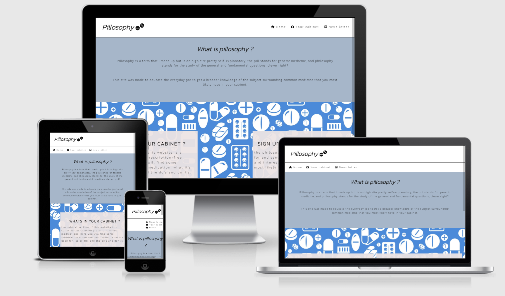

<h1 align="center"></h1>

[View the live project here.](https://userseam.github.io/pillosophy/)

This is the Pillosophy website and is designed to be responsibe and accessible on a range of devices, making it easy to navigate for potential employers and partners.

<h2 align="center"></h2>


## Pillosophy 

Made by: Morad Mouhttouch


## User Experience and User Interface ( UX/UI )
____________________________________________________________________________________________________________________
## Strategy

Pillosophy makes general unknown information about common prescription free
drugs more readily available and super easy to understand.

For example , did you know that grape fruit in combination with many “over the
counter” drugs can cause serious liver damage? Neither did I until last week!

Pillosophy has a collection of the most common medecin and information about them
such as :

```
● Side-effects
● How its made
● Fun fact
● The do’s and don'ts


```


Well , what makes pillosophy so special compared to wikipedia or your doctor?

Wikipedia is a great source to find general information about common drugs and you
should of course always take your doctor's advice about medication (even
prescription free ones) but pillosophy has filter system to faster find what you're
looking for , stunning design , newsletter to keep you updated and all around
interesting facts about our beloved hangover cures.

Why would you use this?

Most people are cautious of what they eat and drink and try not to eat too much
burger king on friday night , but we don't seem to bat an eye when it comes to
medecin. There are of course great quality standards in the modern world but most
people really think about how it works and what precautions should be used to


minimize negative effects, this is hopefully we're pillosophy comes in and brings a
little more clarity to the subject.

Research and interviews

I Have conducted a very shallow interview with a few people ( friends and family)
and this is what they said when I asked them about their knowledge of “the do’s and
don'ts” regarding prescription free medicine.

Mustapha Mouhttouch said _: “I know that drinking alcoholis not the brightest of ides
when it comes to medecin and i know the fundamental effects of common medicine
but really have no idea how they actually work”_

Nikola Dacic said : “ _Well , nowe when I think aboutit , I've never actually thought of
what paracetamol actually is besides that it's good for headaches”._

Vassilis Korpotiadis said: _“Hmmmm .. damn , how comei haven't thought about that”_

Iman Mouhttouch said :” _I had no idea that grape fruitcould cause liver damage when
combined with so many different medecins”_

The one website I can find that actually has a good explanation about common
medecins iswww.fass.sebut seems to lack both visualappeal and good user
experience. The major benefit with the fass website is that it has a lot of information
but is not well organized which makes it even harder to find good and
understandable information.


Target audience

This website is primarily dedicated to educate people about the pros and cons and
the do’s and don'ts of common medecin so there is no specific age group , region ,
or culture that is targeted.

The B2B audience is already dominated by other websites which seem to be mostly
federally run and offer information on a case to case basis on a much larger scale.
These websites also seem to have a huge digital infrastruktur so trying to reach the
B2B aducienc is in point of view pointless.

Summary : The audience target is B2C with no specific criteria.

Expected emotional triggers

```
● branding 
```
I've tried to make the website's branding as self-explanatory as possible and with
mellow colors that correspond to each other well.

The name pillosophy is a hybrid between pills and philosophy.

I've tried to make the name as self-explanatory as possible and to be easily
understood without reading through the material or/and the supporting content.

```
● Transparency
```
Transparency is one of the key factors why i choose to make the site about
prescription free medicine, understandably we don't know much about it and i figured
that if i could bring some light to it by warning people of things that could pontentali
be harmful but also adding a positive element by sharing fun facts on the topic.

```
● What feeling does this site bring?
```
The purpose with the site is not to sell anything but rather offer a hub of information
and presenting it in a visually appealing way and also putting a slight comedic twist


on it. The only possible way that the site could economically benefit the creator
would be to either run ads or have a subscription of sorts.

Product considerations

Is the content strategy up to par?

Using a catchy name for the title and having self explanatory headlines that are still
easily understandable out of context will be one of the advantages compared to
other sites similar to this one.

Having the information separated into different sections/pages will hopefully make
the site less cluttered and having additional navigational links to make the user
experience smooth and to minimize scrolling.

The home page will mostly consist of supporting information and explaining the
concept of the site in a visually appealing way and also being easily understandable.

The design will have a clear branding goal with mellow colors that contrast to each
other and a font style that's easy to read but still stands out.

The journey from the homepage to finding the information you're looking for should
be less than 2 clicks , starting from the homepage to briefly inform the user of the
site's functionality to the do’s and don'ts list.

# Scope

Early conflicts and how they were solved.

( information will be added once they early conflicts have been added)


Was there an agile approach and did it minimize documentation?

Was it kept simple?

```
● Features
```
The features are functional and logical and are understandable out of context. The
purpose of the design and layout is to give the user a good experience with easy to
find information and an attractive design to make the user stay at the site for as long
as possible and explore more features.

There is also a FAQ for common questions for more transparency and a newsletter
for upcoming events and information.

There is good structure and the placed elements make seans and follows the
hierarchy

```
● schedule
```
This project was started on the 21st of march and the goal is to be done with the
project within 2 weeks if possible , the expected milestones will be listed below.

I will be doing a minimum of 5h of work each day. including weekends.

New features that are not listed here will be postponed until further notice.

```
● key milestones and sprints.
```
_Sprint 1:_ Wireframe ( 03-24 )

_Sprint 2:_ UX rapport ( 03-24)


_Sprint 3:_ core structure of the home page ( 03-26)

_Sprint 4:_ core structure of the FAQ page (03-26)

_Sprint 5:_ core structure of the “do’s and don'ts page(03-28)

_Sprint 6:_ core structure of the newsletter page (03-29)

_Sprint 7:_ all the css to the pages listed above (04-01)

_Sprint 8:_ all the responsive design (04-02)

_Sprint 9:_ Readme.md (04-03)

_Sprint 10:_ final evaluation and changes ( 04-04 )

_Sprint 11:_ Submission ( 04-05)

Inorder to avoid or minimize scope creep I will be strictly following the wire frame
structure and work from it unless other additional features are absolutely necessary.

What do they say they need?

After conducting some brief interviews with family and friends the most common
answer was that there is no immediate need but rather a sense of curiosity and
wanting to know more once the subject has been brought to attention.

This further confirms the question of whether this site is something people need/use
once they find out about it.

What do people actually need?

There is rarely an exact answer to this question and the answer is most likely based
on a speculation.

I'm positive that the users don't actually know they need this but are rather intrigued
once they find out about it and read more once they have entered the site.


What do people not know they need?

As I've explained above , this site probably matches the criteria of “something people
don't know about but might need”.

Content requirements

```
● Do the different types of content work together to fulfill the opposing
requirements?
```
The content on the site complements each other and makes scenes from a visual
and functional perspective.

```
● videos , text , images and audio
```
There will be external links for more information on the medecin in question , a
picture of the medecin will also be present with its corresponding text. There will be a
header image ( Hero image ) that acts as a background for the home page.

The size , format and font size/style will change accordingly to the importance of the
material. The introduction header will be larger than the sub headings below it.

# Structure

The navigation and information is rather self explanatory , getting to a different part
of a page is either by internal anchors or on the navigation. Getting from the home
page for the content you're looking for is a maximum of 3 clicks and should not be a
problem to navigate as long as you have very basic knowledge of how navigation
links work.


The content is also separated into different pages depending on the subject you're
looking for, navigating to the subject or information you're looking for is also a max of
3 klicks to further make the user experience as smooth and easy as possible.

The functional and visual interactions should make swans out of context and have an
understandable purpose.

The design and content is in a consistent flow.

The users can also send feedback through email which will be listed in the footer.

The structure is made as simple as possible due to the fact that there is no specific
targeted audience.

# Skeleton

Skeleton plane

- navigation design

I've made the navigation as simple and easy to use as possible, the reason for it is that their
target audience group is unknown and keeping it as simple as possible acountus for the best
user experience.

- interface design

The colors, font style, images, and layout has been chosen to be as visually appealing as
possible but still understandable/readable. The colors contrast each other well and the text is
a color that's readable no matter the background picture or color.

The user will navigate the site using internal/external links or scrolling.

The content will be presented as a pretty generic site, there will be a navigation header
where the other pages of the site will be listed , the other pages will have content
corresponding to the page you are in and each page will also have the header navigation.
There will also be a newsletter which will use the input element.


The most relevant information will be in the home page which will act as a indirect
introduction to the site and will consist of a hero picture and a catchphrase h1 with a
clickable link to another page to the site being “the cabinet”

I've also made sure to include immediate interaction with the h1 in the home page which has
an internal link.

I've also made sure that only the absolutely necessary features are on the site to further
improve UI and minimize the users getting confused or overwhelmed.

Familiar icons will also be added which are pretty much globally understood out of context.

I've also done my best to reduce cognitive friction by having the content being
understandable out of context and a simple yet attractive layout/design, the navigation is
also inherited from the home page and the font style and colors will be the same in all the
pages of the site.

Categorical ordering will be used for clustered content and navigational options relevant to
each other,

Colors : Background color : **HEX #A6B6C9** Textcolor : **HEX  #141414**

---------------------------------------------------------------------------------------------------


-   ### User stories

    -   #### First Time Visitor Goals

        1. As a First Time Visitor, I want to easily understand the main purpose of the site and learn more about common perscription free medecations.
        2. As a First Time Visitor, I want to be able to easily navigate throughout the site to find content.
        3. As a First Time Visitor, I want to se the value of expanding the knowledge of common medecine and understand the riskisk when its combine with other chemicals and/or enzymes 

    -   #### Returning Visitor Goals

        1. As a Returning Visitor, I want to find information about the subject in question as well as reciwe updates throw the news letter.
        2. As a Returning Visitor, I want to find the do's and dont's of the medecines in questions as well as what some common symptoms are.
      

    -   #### Frequent User Goals
        1. As a Frequent User, I want to check to see if there are any newly added medecines in the 'Your cabinet' section.
        2. As a Frequent User, I want to check to see what infomation was sent throw the news letter.
        3. As a Frequent User, I want to sign up to the Newsletter so that I am emailed any major updates and/or changes to the website.

-   ### Design
    -   #### Colour Scheme
        -   Background color : **HEX #A6B6C9**  Textcolor : **HEX  #141414**


    -   #### Typography
        -   The Montserrat font is the main font used throughout the whole website with Sans Serif as the fallback font in case for any reason the font isn't being imported into the site correctly. Montserrat is a clean font used frequently in programming, so it is both attractive and appropriate.
    -   #### Imagery
        -   The hero background image matches the overall design of the website and contranst it well and dose not affect the readebility of the website. The chemichal structure images in the 'your cabinet' section of the website makes seans with its coresponding text and audio file.

*   ### Wireframes


   


## Features

-   Responsive on the following devices : 
* Desktop  1800 x 1225 

* Ipad air  820 x 1180

* Phone (Iphone 12 Pro) 390 x 844 


-   Interactive elements

## Technologies Used

### Languages Used

-   [HTML5](https://en.wikipedia.org/wiki/HTML5)
-   [CSS3](https://en.wikipedia.org/wiki/Cascading_Style_Sheets)

### Frameworks, Libraries & Programs Used

1. [Text to speach](https://projectpages.voicebooking.com/)
    - This was used for the audio files on the 'your cabinet' page.
1. [Amiresponsive] (http://ami.responsivedesign.is/?url=https%3A%2F%2Fuserseam.github.io%2Fpillosophy%2F)
    - This was used to visualy cheek the resposivens of the site as well as provieding a picture on the readme file of the website on diffrent devices.
1. [Google Fonts:](https://fonts.google.com/)
    - Google fonts were used to import the 'Titillium Web' font into the style.css file which is used on all pages throughout the project.
1. [Font Awesome:](https://fontawesome.com/)
    - Font Awesome was used on all pages throughout the website to add icons for aesthetic and UX purposes.
1. [Shrthnd] (https://shrthnd.volume7.io/)
    - This was used to convert the css to short hand properties.
1. [Git](https://git-scm.com/)
    - Git was used for version control by utilizing the Gitpod terminal to commit to Git and Push to GitHub.
1. [GitHub:](https://github.com/)
    - GitHub is used to store the projects code after being pushed from Git.
1. [Photoshop:](https://www.adobe.com/ie/products/photoshop.html)
    - Photoshop was used to create the logo, resizing images and editing photos for the website.
1. [Balsamiq:](https://balsamiq.com/)
    - Balsamiq was used to create the [wireframes] "listed above"  during the design process.

## Testing

The W3C Markup Validator and W3C CSS Validator Services were used to validate every page of the project to ensure there were no syntax errors in the project.

-   [W3C Markup Validator](https://jigsaw.w3.org/css-validator/#validate_by_input) - [Results](https://github.com/)
-   [W3C CSS Validator](https://jigsaw.w3.org/css-validator/#validate_by_input) - [Results](https://github.com/)


### Further Testing

-   The Website was tested on Google Chrome, Internet Explorer, Microsoft Edge and Safari browsers.
-   The website was viewed on a variety of devices such as Desktop, Laptop, Ipad air and Iphone 12 pro.
-   A large amount of testing was done to ensure that all pages were linking correctly and that the positioning of the elements was visualy appeling.
-   Friends and family members were asked to review the site and documentation to point out any bugs and/or user experience issues.

### Known Bugs

none 

## Deployment

04-28

### GitHub Pages

The project was deployed to GitHub Pages using the following steps...

1. Log in to GitHub and locate the [GitHub Repository](https://github.com/)
2. At the top of the Repository (not top of page), locate the "Settings" Button on the menu.
    - Alternatively Click [Here](https://raw.githubusercontent.com/) for a GIF demonstrating the process starting from Step 2.
3. Scroll down the Settings page until you locate the "GitHub Pages" Section.
4. Under "Source", click the dropdown called "None" and select "Master Branch".
5. The page will automatically refresh.
6. Scroll back down through the page to locate the now published site [link](https://github.com) in the "GitHub Pages" section.

### Forking the GitHub Repository

By forking the GitHub Repository we make a copy of the original repository on our GitHub account to view and/or make changes without affecting the original repository by using the following steps...

1. Log in to GitHub and locate the [GitHub Repository](https://github.com/)
2. At the top of the Repository (not top of page) just above the "Settings" Button on the menu, locate the "Fork" Button.
3. You should now have a copy of the original repository in your GitHub account.

### Making a Local Clone

1. Log in to GitHub and locate the [GitHub Repository](https://github.com/)
2. Under the repository name, click "Clone or download".
3. To clone the repository using HTTPS, under "Clone with HTTPS", copy the link.
4. Open Git Bash
5. Change the current working directory to the location where you want the cloned directory to be made.
6. Type `git clone`, and then paste the URL you copied in Step 3.

```
$ git clone https://github.com/userseam/pillosophy
```

7. Press Enter. Your local clone will be created.

```
$ git clone https://github.com/userseam/pillosophy
> Cloning into `Pillosophy-Clone`...
> remote: Counting objects: 10, done.
> remote: Compressing objects: 100% (8/8), done.
> remove: Total 10 (delta 1), reused 10 (delta 1)
> Unpacking objects: 100% (10/10), done.
```

Click [Here](https://help.github.com/en/github/creating-cloning-and-archiving-repositories/cloning-a-repository#cloning-a-repository-to-github-desktop) to retrieve pictures for some of the buttons and more detailed explanations of the above process.

## Credits

https://en.wikipedia.org/   / was used to obtain a rather large part of the text content but have been restructed to make gramatic seans and being easyer to read.

https://depositphotos.com / was used to obitan all the images in the websites and have I have reciwed premission to use the picutres with fair use  

Love running / Some of the layout of the love running page was majoyr influense to the Pillosophy website , the code used will be listed below the "code" section.

https://github.com/Code-Institute-Solutions/SampleREADME / The main strucutre of the readme file from CI was used and all the infomation has been changed to match the Pillosophy website.


### Code

-(1)    "form method="POST" action="https://formdump.codeinstitute.net/" class="signup-form""   
This line of code was taken from Love Running Walkthrough Project  Challenge: Signup Form  Signup Form: Challenge 2  


                "<li>
                    <a href="index.html">Home</a>
                </li>
            </ul>
        </nav>
    </header>
    <section class="form-section" class="signup-form">
        <form method="POST" action="https://formdump.codeinstitute.net/" class="signup-form">
            <h2>Let's get you signed up! <i class="fas fa-heartbeat"></i></h2>
            <label for="fname">First Name</label>
            <input id="fname" name="first_name" type="text" required class="text-input">
            
            <label for="lname">Last Name</label>
            <input id="lname" name="last_name" type="text" required class="text-input">
            
            <label for="email">Email Address</label>
            <input type="email" id="email" name="email_address" required class="text-input">
            
            <label for="road">Road</label>
            <input type="radio" id="road" name="running_preference" value="road" required>
            <label for="trail">Trail</label>
            <input type="radio" id="trail" name="running_preference" value="trail" required>
            <label for="both">Both</label>
            <input type="radio" id="both" name="running_preference" value="both" required>
            
            <input class="join-button" type="submit" value="Let's Run!" calss="join-button ">
        </form>
    </section>"

This snippet of code was taken from the same source as the one above and has been edited to show the relevent information as was listen in the wire frame to acheive the target I was looking for 

COVER TEXT 

    font-size: 130%;
    font-family: Oswald, sans-serif;
    text-transform: uppercase;
    letter-spacing: 4px;

    width: 300px;
    height: 200px;

    padding-top: 40px;
    padding-left: 10px;

    background-color: rgba(241, 109, 107, .7);
    bottom: 30px;
    right: 150px;

    position: absolute; 

NAVIGATION 

#menu {
    font-size: 110%;
    letter-spacing: 4px;
}

#menu li {
    float: right;
    list-style-type: none;
    margin-right: 30px;
}

#menu a {
    text-decoration: none;
    color: inherit;
}


#menu , #logo {
    line-height: 75px;
}

#menu a:hover {
    border-bottom: 1px solid #3a3a3a;
}


This sinppet of CSS was inspered from the love  running project cover text div ,  The code in the Pillosophy inspered from this snippet has been changed to achive the target and positioning that was displayed on the wireframes 

## Visual diffrens of credited code
________________________


-   [Bootstrap4](https://getbootstrap.com/docs/4.4/getting-started/introduction/): Bootstrap Library used throughout the project mainly to make site responsive using the Bootstrap Grid System.

-   [MDN Web Docs](https://developer.mozilla.org/) : For Pattern Validation code. Code was modified to better fit my needs and to match an Irish phone number layout to ensure correct validation. Tutorial Found [Here](https://developer.mozilla.org/en-US/docs/Web/HTML/Element/input/tel#Pattern_validation)

### Content

-   All content was written by the developer.

-   Psychological properties of colours text in the README.md was found [here](http://www.colour-affects.co.uk/psychological-properties-of-colours)

### Media

-   All Images were created by the developer.

### Acknowledgements

-   My Mentor for continuous helpful feedback.

-   Tutor support at Code Institute for their support.